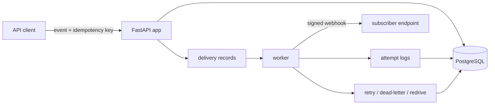

# Hi, I'm Jinho

Computer Science student building backend systems from the ground up. I care
less about how much I can stack together and more about being able to defend
every decision: why a retry queue over a cron job, why a database constraint over
an application-level check, what breaks under concurrency, and how I handle it.

Most of what I build lives in the unglamorous parts of the happy path: retries,
partial failures, idempotency, and the edge cases that only show up in
production.

## Currently Working On

**[Reliable Webhook Delivery Platform](https://github.com/jinhobh/reliable-webhook-platform)**  
`FastAPI` · `PostgreSQL` · `SQLAlchemy` · `Alembic` · `Docker`

A service for reliably delivering webhooks to subscriber endpoints. Payloads are
signed with HMAC-SHA256 so receivers can verify authenticity, and failed
deliveries are retried with backoff rather than dropped. The interesting work is
the failure handling: what counts as a delivery, when to give up, and how to keep
retries from stepping on each other.

## Currently Learning

- State machine modeling for resource lifecycles
- Idempotency and safe retries
- Concurrency control through database constraints
- Cryptographic token hashing and secure invite/link design

**Next up:** a real-time collaborative editor to get hands-on with WebSockets and
presence management.

## Tools

## How I Work

I learn by building. I'd rather ship a small thing that handles the hard cases
correctly than a big thing that only works on the demo. If a design decision
can't be explained with its tradeoffs, it's not finished yet.

## Reach Me

- Email: jinho.baej@gmail.com
