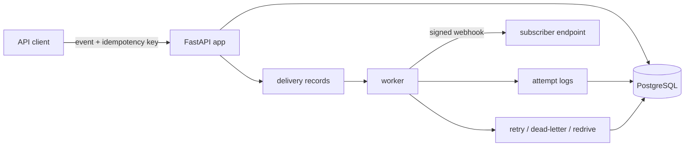
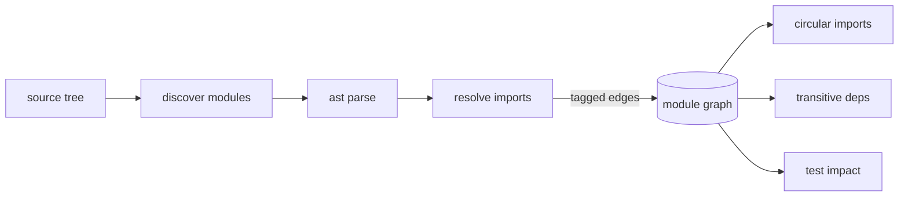

# Jinho

CS student building backend systems.

## Reliable Webhook Delivery Platform

[Repo](https://github.com/jinhobh/reliable-webhook-platform) · [Live demo](https://hookit.fly.dev/dashboard/)  
`FastAPI` · `PostgreSQL` · `SQLAlchemy` · `Alembic` · `Docker`

At-least-once webhook delivery: HMAC-signed, retried with backoff and jitter, dead-lettered and redriven, Postgres as the queue instead of a broker. The live dashboard streams real events into a Discord channel — kill the receiver and watch retries → backoff → dead-letter → redrive on live traffic.

```mermaid
flowchart LR
    Client[API client] -->|event + idempotency key| API[FastAPI app]
    API --> DB[(PostgreSQL)]
    API --> Delivery[delivery records]
    Delivery --> Worker[worker]
    Worker -->|signed webhook| Endpoint[subscriber endpoint]
    Worker --> Attempts[attempt logs]
    Worker --> Retry[retry / dead-letter / redrive]
    Attempts --> DB
    Retry --> DB
```

## TraceGraph

[Repo](https://github.com/jinhobh/TraceGraph)  
`Python` · `ast` · `stdlib-only` · `pytest` · `coverage.py`

Static dependency analyzer for Python. Parses each module with `ast`, resolves imports into a directed graph, then uses it to detect circular imports and select the tests affected by a change. Every edge is tagged `module` / `function` / `type_checking` and `module` / `symbol`, so a cycle is flagged as load-time only when it runs through a `symbol` edge — the pattern that can actually raise `ImportError`. Test impact analysis is validated against coverage.py ground truth on Flask and requests: **recall 1.00**, zero false negatives.

```mermaid
flowchart LR
    Src[source tree] --> Discovery[discover modules]
    Discovery --> Parse[ast parse]
    Parse --> Resolver[resolve imports]
    Resolver -->|tagged edges| Graph[(module graph)]
    Graph --> Cycles[circular imports]
    Graph --> Deps[transitive deps]
    Graph --> TIA[test impact]
```

## Tools

## Reach me

- [jinho.baej@gmail.com](mailto:jinho.baej@gmail.com)
- [jinhobae.xyz](https://jinhobae.xyz)
