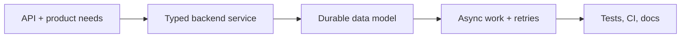
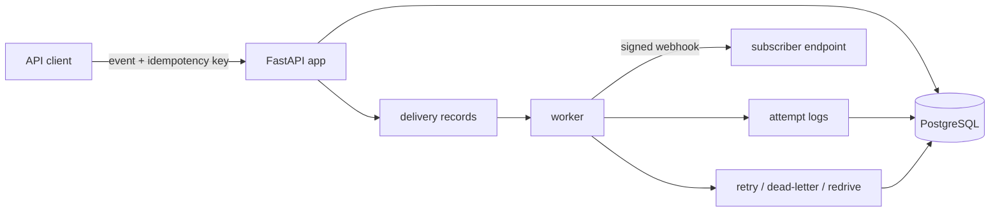

# Hi, I'm Jinho

Software engineering student building backend systems from the ground up. I care
less about how much I can stack together and more about being able to defend
every decision: why a retry queue over a cron job, why a database constraint over
an application-level check, what breaks under concurrency, and how I handle it.

Most of what I build lives in the unglamorous parts of the happy path: retries,
partial failures, idempotency, and the edge cases that only show up in
production.

**Open to:** backend, platform, infrastructure, and developer-tooling roles.

## What I Build

```mermaid
flowchart LR
    A[API + product needs] --> B[Typed backend service]
    B --> C[Durable data model]
    C --> D[Async work + retries]
    D --> E[Tests, CI, docs]
```

## Selected Work

**[Reliable Webhook Delivery Platform](https://github.com/jinhobh/reliable-webhook-platform)** — [live demo](https://hookit.fly.dev/dashboard/)  
`FastAPI` · `PostgreSQL` · `SQLAlchemy` · `Alembic` · `Docker`

At-least-once webhook delivery: HMAC-signed, retried with backoff and jitter,
dead-lettered and redriven, Postgres as the queue instead of a broker. The live
dashboard streams real events into a real Discord channel — kill the receiver
and watch retries → backoff → dead-letter → redrive happen on live traffic.
Built with a self-advancing agent pipeline (Planner → Builder → Reviewer,
CI-gated auto-merge; see the repo's `CLAUDE.md`).

```mermaid
flowchart LR
    Client[API client] -->|event + idempotency key| API[FastAPI app]
    API --> DB[(PostgreSQL)]
    API --> Delivery[delivery records]
    Delivery --> Worker[worker]
    Worker -->|signed webhook| Endpoint[subscriber endpoint]
    Worker --> Attempts[attempt logs]
    Worker --> Retry[retry / dead-letter / redrive]
    Attempts --> DB
    Retry --> DB
```

**[tracegraph](https://github.com/jinhobh/tracegraph)**  
Python static dependency analyzer for import graphs, circular-import detection,
and test impact analysis.

**[Granola](https://github.com/jinhobh/granola)**  
Mobile-first product planning around content models, privacy, search, metadata,
and user flows.

## Currently Learning

- Agentic engineering: multi-agent pipelines with CI as the trust boundary
  between them
- SSRF-aware and other adversarial-input hardening for services that accept
  user-supplied URLs
- Multi-tenant data isolation patterns at the database layer

**Next up:** a real-time collaborative editor to get hands-on with WebSockets and
presence management.

## Tools

## How I Work

I learn by building. I'd rather ship a small thing that handles the hard cases
correctly than a big thing that only works on the demo. If a design decision
can't be explained with its tradeoffs, it's not finished yet.

## Reach Me

- Email: jinho.baej@gmail.com
